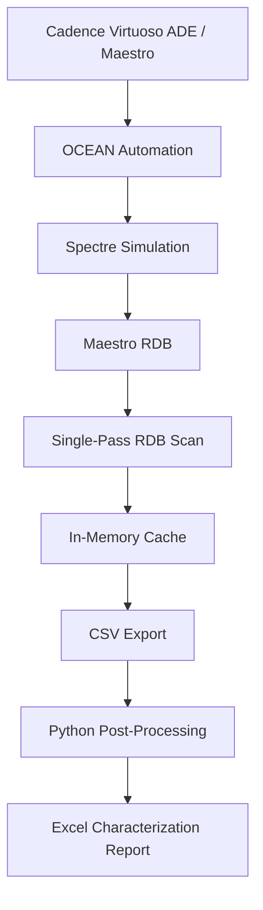
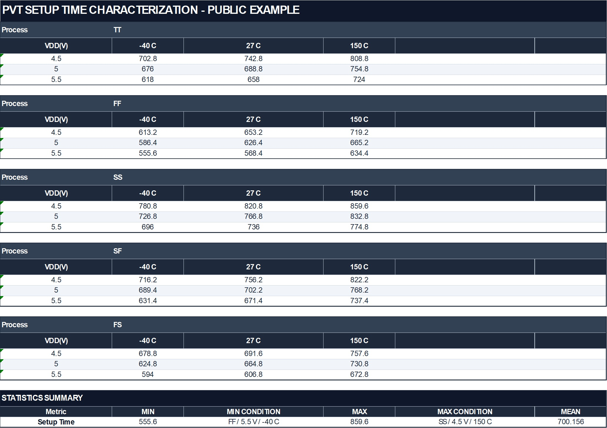
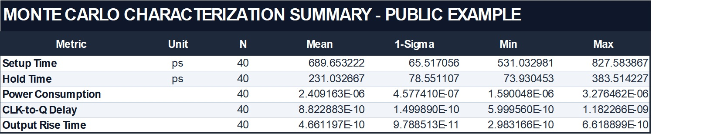

# DFF Characterization Automation

Automated DFF characterization framework for Cadence Virtuoso ADE Explorer/Assembler using OCEAN/SKILL and Python.

This project automates DFF setup/hold timing characterization across PVT and Monte Carlo conditions, exports characterization data to CSV, and generates summarized Excel reports. To reduce post-processing overhead, it uses a single-pass Maestro RDB caching architecture instead of repeatedly traversing the result database.

## Highlights

- Automated DFF setup/hold characterization across PVT and Monte Carlo conditions
- End-to-end Cadence OCEAN/SKILL → CSV → Python → Excel workflow
- Single-pass Maestro RDB caching architecture
- **124.89× faster** PVT post-processing
- **105.38× faster** Monte Carlo post-processing
- More than **99% runtime reduction** while preserving identical result counts and checksums

---

## Architecture



The framework supports setup-time characterization, hold-time characterization, PVT characterization, Monte Carlo characterization, additional scalar metric extraction, CSV export, Excel report generation, and post-processing benchmarking.

---

## Characterization Method

Setup and hold timing are extracted from CLK-to-Q degradation.

```text
1. Sweep setup or hold timing
2. Evaluate CLK-to-Q delay at each sweep point
3. Use CLK-to-Q at the 1 ns reference point as nominal
4. Set threshold = nominal CLK-to-Q × 1.005
5. Find the falling threshold crossing
6. Linearly interpolate between adjacent sweep points
```

The reference PVT configuration contains:

```text
5 Process Corners × 3 Temperatures × 3 Supply Voltages
= 45 PVT Conditions
```

Monte Carlo sample count, random seed, temperature, voltage, and model section are configurable.

For implementation details, see [Characterization Methodology](docs/characterization_methodology.md).

---

## Example Outputs

The following screenshots use public-safe example data while preserving the structure and format of the generated reports.

### PVT Setup-Time Characterization



### Monte Carlo Characterization Summary



---

## Benchmark

The Legacy implementation repeatedly traverses the Maestro RDB for individual conditions and metrics. The optimized implementation scans the RDB once, caches the required data, and performs subsequent processing from memory.

Each benchmark was repeated three times, and the median Legacy and Single-Pass runtimes were used as representative values.

| Characterization | Legacy | Single-Pass | Speedup | Runtime Reduction |
|---|---:|---:|---:|---:|
| PVT | 1124 s | 9 s | **124.89×** | **99.20%** |
| Monte Carlo | 1686 s | 16 s | **105.38×** | **99.05%** |

For both PVT and Monte Carlo benchmarks, the Legacy and Single-Pass implementations produced identical result counts and checksums.

For benchmark methodology and optimization details, see [Post-Processing Optimization](docs/postprocessing_optimization.md).

---

## Project Structure

```text
dff-characterization-automation/
├── assets/
│   ├── monte_characterization_summary.jpg
│   └── pvt_setup_characterization.jpg
├── benchmark/
│   ├── benchmark_monte_postprocess.ocn
│   └── benchmark_pvt_postprocess.ocn
├── config/
│   ├── config.il                  # local, Git-ignored
│   └── config.example.il
├── docs/
│   ├── characterization_methodology.md
│   └── postprocessing_optimization.md
├── ocean/
│   ├── dff_monte_characterization.ocn
│   └── dff_pvt_characterization.ocn
├── python/
│   ├── monte_summary.py
│   └── pvt_summary.py
├── .gitignore
├── LICENSE
├── setup.csh
└── README.md
```

Generated raw CSV files, logs, and Excel reports are excluded from Git.

---

## Configuration

Create a local configuration file:

```bash
cp config/config.example.il config/config.il
```

Then update the local Cadence project, DUT, PDK, and characterization settings in `config/config.il`.

The local configuration is excluded from Git because it may contain user-specific simulation paths and proprietary PDK paths.

---

## Usage

From the project root:

```csh
source setup.csh
```

Launch Virtuoso from the same shell.

### PVT Characterization

From the Virtuoso CIW:

```lisp
load(
    strcat(
        getShellEnvVar("DFF_CHAR_ROOT")
        "/ocean/dff_pvt_characterization.ocn"
    )
)
```

### Monte Carlo Characterization

```lisp
load(
    strcat(
        getShellEnvVar("DFF_CHAR_ROOT")
        "/ocean/dff_monte_characterization.ocn"
    )
)
```

The flows automatically run simulation, read the Maestro RDB, build the cache, extract timing and scalar metrics, export CSV files, and generate Excel reports through Python post-processing.

---

## Requirements

- Cadence Virtuoso ADE Explorer / Assembler
- Spectre
- OCEAN / SKILL
- Python 3
- openpyxl
- csh / tcsh

A compatible Cadence environment and appropriate process model files are required.

PDK files, proprietary model files, and proprietary Cadence simulation databases are not included in this repository.

---

## License

This project is licensed under the MIT License. See the [LICENSE](LICENSE) file for details.

The MIT License applies only to the source code and documentation contained in this repository. Proprietary EDA tools, PDKs, process model files, Cadence simulation databases, and other third-party intellectual property are not included or distributed under this license.

